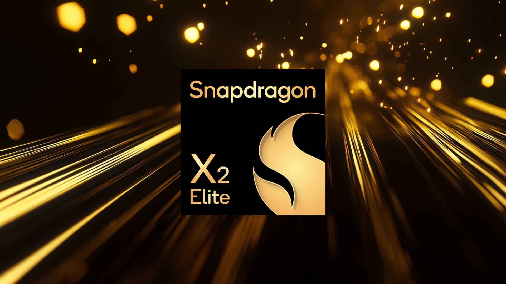
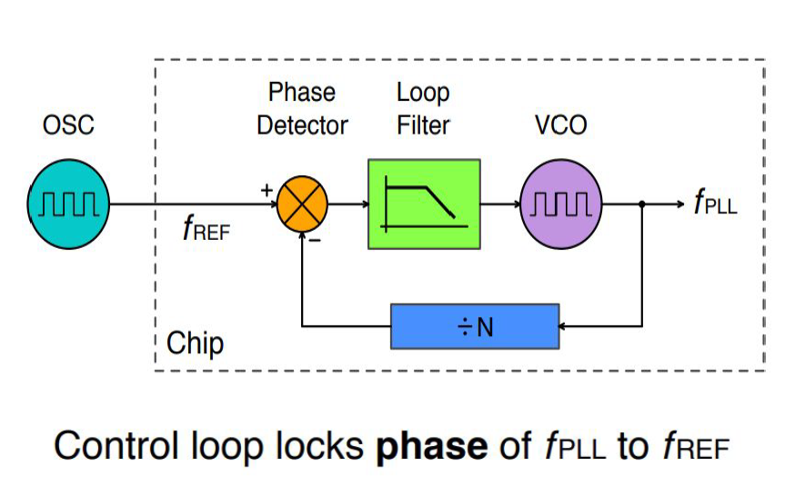
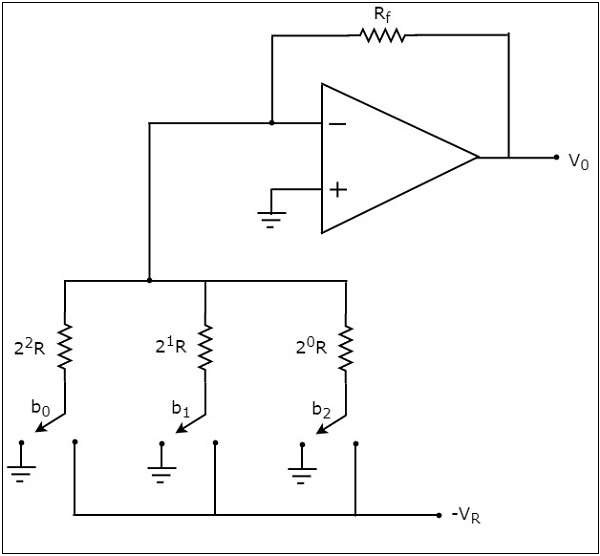
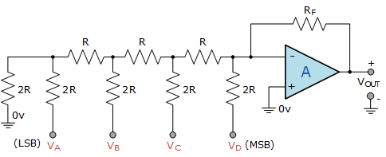
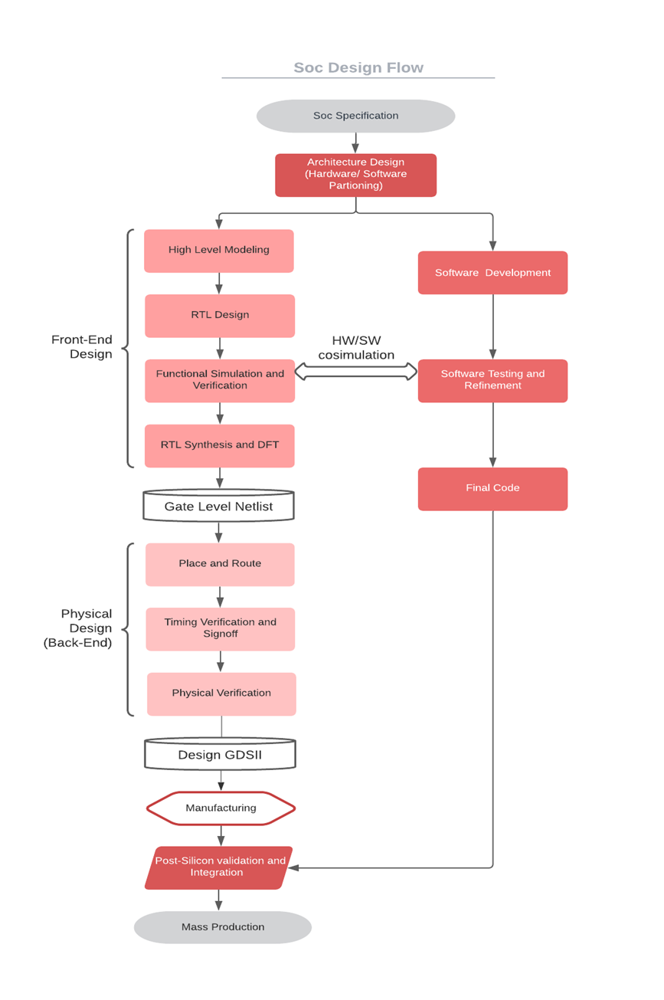

# Part 1: Understanding System-on-Chip (SoC) and BabySoC

This week focuses on the fundamentals of **System-on-Chip (SoC)** design and introduces the **BabySoC** project, a simplified educational model for learning SoC concepts through hands-on experimentation. This report summarizes the research made as part of research-based learning for this week.

---

## 1. What is a System-on-Chip (SoC)?

A **System-on-Chip (SoC)** is essentially a **complete computer on a single chip**. Instead of relying on multiple separate components (CPU, memory, I/O controllers, etc.), an SoC integrates them into one compact, power-efficient package.

This integration makes SoCs the backbone of modern portable and embedded systems — from smartphones and wearables to IoT devices, automotive electronics, and home appliances.

**Key benefits of SoCs:**

* **Compact:** Saves space by combining multiple components.
* **Efficient:** Consumes less power, ideal for battery-powered devices.
* **High Performance:** Shorter communication paths allow faster processing.
* **Cost Effective:** Reduced manufacturing and PCB complexity.
* **Reliable:** Fewer external connections mean fewer failure points.

 
---

## 2. Components of a Typical SoC

A typical SoC includes the following integrated building blocks:

1. **CPU (Central Processing Unit)**

   * Executes instructions, manages data, and coordinates system tasks.
   * Can be single-core or multi-core.

2. **Memory**

   * **RAM (volatile):** Temporary storage for active programs and data.
   * **ROM/Flash (non-volatile):** Stores firmware and boot code.

3. **Peripherals / I/O Interfaces**

   * Enable communication with the outside world (e.g., UART, SPI, I²C, GPIO).
   * Connects to sensors, displays, storage, and external devices.

4. **Graphics Processing Unit (GPU)**

   * Handles image rendering, gaming, and video playback.

5. **Digital Signal Processor (DSP)**

   * Optimized for audio, video, and real-time signal processing.

6. **Power Management**

   * Controls energy distribution and efficiency across the chip.

7. **Interconnect / Bus**

   * The backbone wiring inside the SoC, allowing data exchange between CPU, memory, and peripherals.

8. **Special Features**

   * Security modules, Wi-Fi, Bluetooth, and application-specific accelerators (AI, ML, etc.).

---

## 3. Types of SoCs

SoCs can be broadly categorized into three types:

* **Microcontroller-based SoC**

  * Built around a microcontroller with CPU, memory, and I/O integrated.
  * Used in IoT devices, home automation, and appliances where low power is critical.

* **Microprocessor-based SoC**

  * Designed for more complex tasks, often with external memory.
  * Found in smartphones, tablets, and laptops where operating systems and multitasking are required.

* **Application-Specific SoC (ASIC-based)**

  * Tailored for a particular use case such as graphics, AI, or automotive systems.
  * Provides optimized performance for specific applications.

---

## 4. Popular SoCs

Some widely recognized SoCs that power today’s devices:

* **Apple A-series** – powers iPhones and iPads.
* **Qualcomm Snapdragon** – popular in Android smartphones.
* **Samsung Exynos** – designed for Samsung devices.
* **NVIDIA Tegra** – used in gaming consoles and automotive systems.
* **MediaTek Dimensity** – Cost-effective, powerful SoCs used in midrange and flagship phones.

---

## 5. Why BabySoC?

**BabySoC** (VSDBabySoC) is a **simplified, open-source educational SoC** built on the **RISC-V architecture**. It is not meant to rival commercial SoCs in complexity but to:

* Provide a **learning-friendly environment** to understand SoC fundamentals.
* Demonstrate how **digital (CPU) and analog (DAC, PLL)** blocks coexist in a single design.
* Offer hands-on experience in **functional modeling** before diving into detailed RTL and physical design.

### Main Components of BabySoC

* **RVMYTH Processor (CPU):**
  A lightweight RISC-V processor core that executes instructions and drives the overall SoC operation.
* **PLL (Phase-Locked Loop):**
  Generates stable and synchronized clock signals, ensuring reliable timing across components.
  
* **DAC (Digital-to-Analog Converter):**
  Converts digital values into analog outputs, enabling BabySoC to interact with devices like speakers and displays.
  Few Types of DAC:
  - **Weighted Binary Resistor DAC**
  
  
  - **R-2R Resistor DAC**
   

This minimal yet functional integration makes BabySoC a stepping stone to understanding more advanced SoCs. The working and design aspects of BabySoC is present in the Part2-Labs README.md file.It contains the basic block diagram along with execution of the program present in the RISCV-Core and DAC along with the calculations.

---

## 6. The Role of Functional Modeling in SoC Design

The **SoC design flow** typically follows these stages:

1. **Specification** → Define system requirements.
2. **Functional Modeling** → High-level models (in C, Python, or behavioral Verilog) are built to validate concepts before investing in RTL.
3. **RTL Design & Verification** → Develop detailed hardware descriptions and test correctness.
4. **Synthesis** → Convert RTL into gate-level circuits.
5. **Physical Design & Fabrication** → Map circuits to silicon using processes like Sky130.

**Why Functional Modeling Matters:**

* It lets designers test system behavior early.
* Reduces design risks by identifying issues before costly RTL/physical design stages.
* Encourages experimentation and learning without needing fabrication resources.

BabySoC emphasizes this early modeling stage — making it an **ideal educational platform** to bridge theory with practice.

---

## 7. Summary

* A **System-on-Chip (SoC)** integrates CPU, memory, peripherals, and interconnect into one chip, powering most modern devices.
* SoCs provide high performance, compactness, and efficiency but come with design challenges like complexity and heat management.
* **BabySoC** is a simplified SoC that uses RVMYTH, PLL, and DAC to help learners understand both digital and analog integration.
* Through **functional modeling**, BabySoC enables learners to explore SoC concepts **before RTL and physical design**, making it an effective foundation for deeper SoC design education.

---

📌 This research summary serves as a learning journey into **SoC fundamentals**, with **BabySoC** as a practical, hands-on model to connect theoretical concepts with real-world hardware design. Further exploration into BabySoC is done in the Part2-Labs whether we dive in to the real SoC action.

