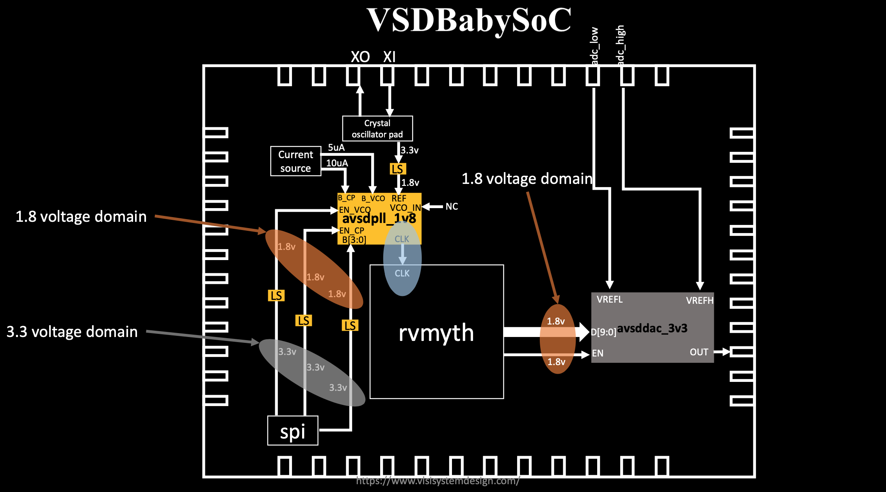
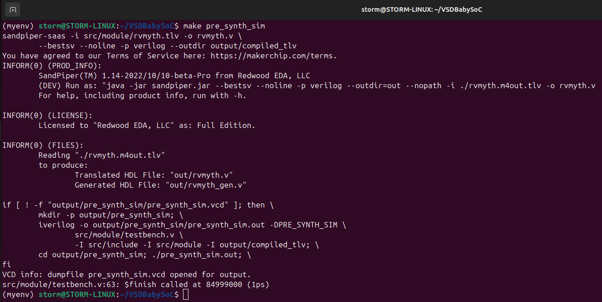
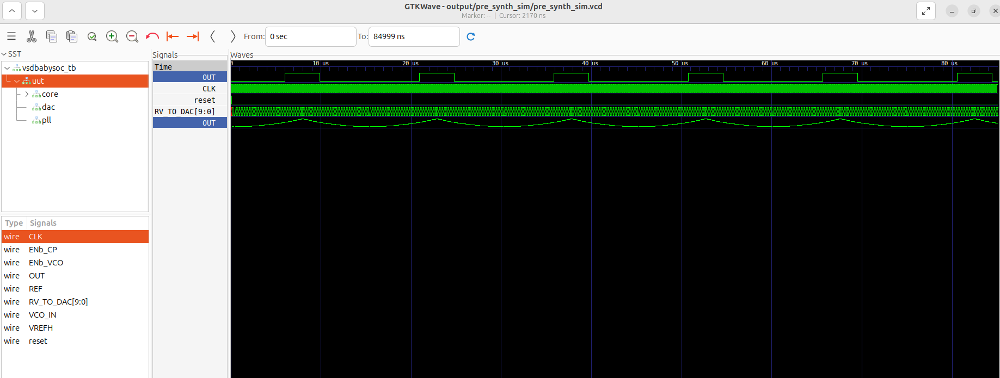
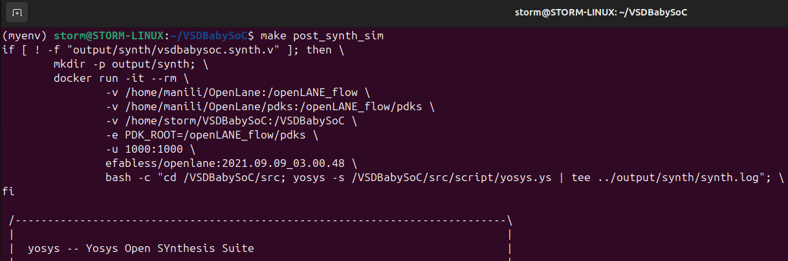
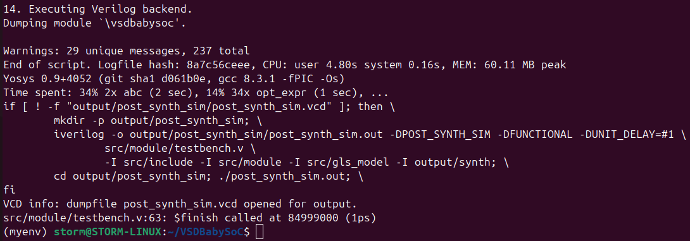
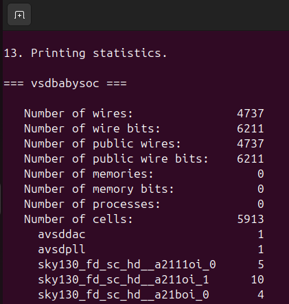
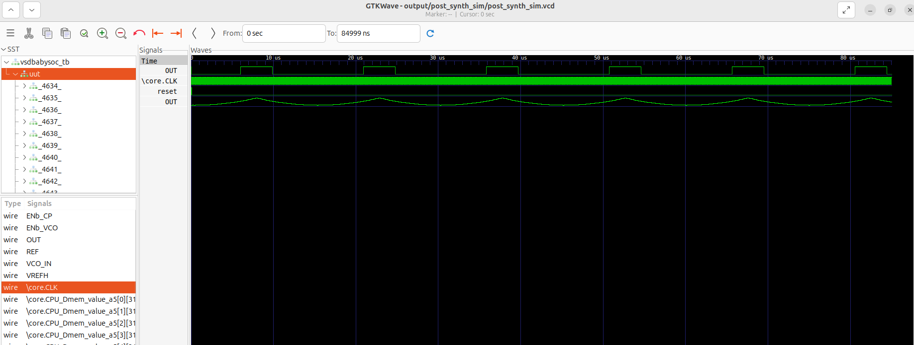
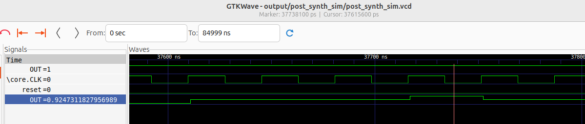

# Week 2 Task – BabySoC Fundamentals & Functional Modelling

The **VSDBabySoC** is a small yet powerful RISC-V based SoC.

It contains:

* One **RVMYTH** microprocessor (**RISCV-based processor**)
* An **PLL** to generate a stable clock
* A **10-bit DAC** to communicate with analog devices



---

# 📂 Project Structure

```
VSDBabySoC/
├── src/
│   ├── include/
│   │   ├── sandpiper.vh       # Common header and macros
│   │   └── other header files...
│   ├── module/
│   │   ├── vsdbabysoc.v       # Top-level SoC module
│   │   ├── rvmyth.v           # RISC-V processor core
│   │   ├── avsdpll.v          # PLL module
│   │   ├── avsddac.v          # DAC module
│   │   └── testbench.v        # Testbench for verification
├── output/                    # Stores simulation results
└── compiled_tlv/              # Holds compiled intermediate files (if needed)
```

---

# VSDBabySoC Modeling

We model and simulate the SoC using **iverilog**, and then visualize the results using **gtkwave**.

* Initial signals are fed into the `vsdbabysoc` module to start PLL clock generation.
* The PLL-generated `CLK` drives the **RVMYTH** processor, executing instructions from `imem`.
* The register `r17` produces values cycle by cycle, which are passed to the **DAC**.
* The DAC converts these values into the **final SoC output signal (`OUT`)**.

Thus, the SoC consists of:

* **3 main IPs (RVMYTH, PLL, DAC)**
* A **wrapper** for integration called **vsdbabysoc.v**
* A **testbench module** for verification

---

## 🛠 Requirements

* **Icarus Verilog** → Compilation & simulation
* **GTKWave** → Waveform visualization
* **Python3 & Sandpiper-SaaS** → TLV to Verilog translation
* **Unix-like OS** (Linux/macOS recommended)

---

## RVMYTH Modeling

Since **RVMYTH** is written in **TL-Verilog(Transaction-Level Verilog)**, we need to translate it into Verilog for integration.

* We use **sandpiper-saas** to compile TLV → Verilog.

---

## PLL and DAC Modeling

A **Phase-Locked Loop (PLL)** is a control system that generates an output signal whose **phase is locked** to an input signal.

* Widely used in synchronization, frequency synthesis, and clock distribution.
* In this SoC, it ensures the processor and peripherals run in sync at a stable clock frequency.

A **Digital-to-Analog Converter (DAC)** converts **digital values into analog signals**.

* Used in communication systems to generate waveforms like audio or video.
* High-speed DACs power mobile communications and ultra-fast DACs enable optical communication.
* In this project, the DAC provides the SoC’s final analog output.


Although Verilog does not directly synthesize analog designs, it allows **real-type** signals for simulation.

* PLL reference: [rvmyth_avsdpll_interface](https://github.com/vsdip/rvmyth_avsdpll_interface)
* DAC reference: [rvmyth_avsddac_interface](https://github.com/vsdip/rvmyth_avsddac_interface)

---

## Simulation

### 1. Install Sandpiper-saas using python3-venv

```bash
sudo apt update
sudo apt install python3.12-venv
python3 -m venv myenv
source myenv/bin/activate

```

```bash
pip install --upgrade pip
pip install pyyaml click sandpiper-saas
```

### 2. Clone VSDBabySoC repository

```bash
cd ~
git clone https://github.com/manili/VSDBabySoC.git
```

### 3. Run Pre-Synthesis Simulation

```bash
cd VSDBabySoC
make pre_synth_sim
```


This generates output at `output/pre_synth_sim/pre_synth_sim.vcd`.

### 4. View Waveforms

```bash
gtkwave output/pre_synth_sim/pre_synth_sim.vcd
```

---

# Run Post-Synthesis Simulation and Waveforms

Synthesize the generated RTL code and after that we can simulate the result.The post and pre (modeling section) synthesis results should be identical.

**SIMULATION**





**WAVEFORMS**



In this picture we can see the following signals:

  * **\core.CLK:** This is the `input CLK` signal of the `RVMYTH` core. This signal comes from the PLL, originally.
  * **reset:** This is the `input reset` signal of the `RVMYTH` core. This signal comes from an external source, originally.
  * **OUT:** This is the `output OUT` signal of the `VSDBabySoC` module. This signal comes from the DAC (due to simulation restrictions it behaves like a digital signal which is incorrect), originally.
  * **\core.OUT[9:0]:** This is the 10-bit `output [9:0] OUT` port of the `RVMYTH` core. This port comes from the RVMYTH register #17, originally.
  * **OUT:** This is a `real` datatype wire which can simulate analog values. It is the `output wire real OUT` signal of the `DAC` module. This signal comes from the DAC, originally.

**NOTE** that the sythesis process does not support `real` variables, so we must use the simple `wire` datatype for the `\vsdbabysoc.OUT` instead. The `iverilog` simulator always behaves `wire` as a digital signal. As a result we can not see the analog output via `\vsdbabysoc.OUT` port and we need to use `\dac.OUT` (which is a `real` datatype) instead.


# 📦 Module Descriptions

### 🔹 `vsdbabysoc.v` (Top-Level SoC Module)

* Integrates all IP cores
* Handles interconnections between processor, PLL, DAC

### 🔹 `rvmyth.v` (RISC-V Core)

* RV32I CPU built during the VSD-Redwood workshop
* Produces digital control and data values

### 🔹 `avsdpll.v` (PLL Module)

* Clock multiplier/divider for stable synchronization

### 🔹 `avsddac.v` (DAC Module)

* Converts digital RVMYTH outputs to analog signals

### 🔹 `Testbench`

The `testbench.v` file verifies SoC functionality. It handles:

* Signal initialization
* Clock and reset generation
* Waveform dumping for simulation

---


# Working of RVMYTH Core and DAC (DataFlow between Modules)

The Verilog code implements a simple **5-stage pipeline** (Fetch → Decode → Execute → Memory → Writeback). The instruction ROM contains a short program (13 instructions) that (1) builds a sum in register `x17`, (2) then subtracts that same sum back out, and (3) it repeats the whole program again (sum → subtract → repeat).


## Top-level module interface

```verilog
module rvmyth(
  output reg [9:0] OUT,  // 10-bit output for visualization
  input  CLK,
  input  reset
);
```

* `OUT` is a 10-bit register that the module drives each clock:

  ```verilog
  always @(posedge CLK) begin
    OUT = CPU_Xreg_value_a5[17];
  end
  ```

  Because `OUT` is 10 bits, it receives the **lower 10 bits** (LSBs) of `x17` (the 32-bit register file entry) when sampled.

---

## Pipeline overview

The generated core is organized into logical pipeline "labels" (a0..a5) corresponding to standard RISC-V pipeline stages:

* **@0 (Fetch)** — compute next PC, request instruction memory read.
* **@1 (Decode)** — latch instruction bits, classify instruction type (R/I/S/B/U/J), build immediates, determine rs1/rs2/rd.
* **@2 (Register read)** — read register file values, compute branch/jump targets.
* **@3 (Execute / ALU)** — arithmetic/logic, set results, evaluate branch conditions.
* **@4 (Memory)** — data memory read/write.
* **@5 (Writeback)** — write result back to register file; this is where `x17` is visible as `CPU_Xreg_value_a5[17]`.

---

## Instruction memory (ROM)

The program is stored in `instrs[0..12]`. The generated Verilog assigns these 32-bit words (shown here as assembly code):

```
Inst #0:  ADDI x9,  x0, 1           // instrs[0] = {12'b000000000001, 5'd0, 3'b000, 5'd9, 7'b0010011}
Inst #1:  ADDI x10, x0, 101011_b    // instrs[1] = {12'b101011, 5'd0, 3'b000, 5'd10, 7'b0010011}
Inst #2:  ADDI x11, x0, 0
Inst #3:  ADDI x17, x0, 0

Inst #4:  ADD  x17, x17, x11
Inst #5:  ADDI x11, x11, 1
Inst #6:  BNE  x11, x10, -8        // loop back (negative branch offset)

Inst #7:  ADD  x17, x17, x11

Inst #8:  SUB  x17, x17, x11
Inst #9:  SUB  x11, x11, x9        // x9 is 1, so this decrements x11
Inst #10: BNE  x11, x9, -8        // loop back while x11 != 1

Inst #11: SUB  x17, x17, x11

Inst #12: BEQ x0, x0, -32         // infinite loop (halt)
```

**Important detail:** The immediate used in `instrs[1]` is written as `12'b101011` in the Verilog. That is *binary* `101011` (6 bits set in a 12-bit field) → **decimal value = 43**. 

---

## Execution: Calculations

### Initialization (after Inst #0–#3)

Execute the first four instructions sequentially:

* `Inst #0: ADDI x9,  x0, 1`  → `x9  = 1`
* `Inst #1: ADDI x10, x0, 101011_b` → `x10 = 0b101011 = 43`
* `Inst #2: ADDI x11, x0, 0`  → `x11 = 0`
* `Inst #3: ADDI x17, x0, 0`  → `x17 = 0`

```
x9  = 1
x10 = 43
x11 = 0
x17 = 0
```

---

### Summation loop (Inst #4, #5, #6) — run until x11 == x10

```
Inst #4:  x17 = x17 + x11
Inst #5:  x11 = x11 + 1
Inst #6:  if (x11 != x10) branch back to Inst #4
```

* Each iteration increments x11 **after** the add and then compares x11 to x10.
* The loop repeats while `x11 != 43`.

When the loop exits, the add at Inst #4 has run for `x11 = 0..42` (43 times). After the last executed Inst #5, `x11 = 43` and the BNE fails, so the loop exits.

After loop exit, `Inst #7` executes:

```
Inst #7: x17 = x17 + x11   // add the final x11 = 43
```

So the total `x17` after the summation sequence is:

```
x17 = 1+2+3+ ..... + 42 = 903
x17 = 903 + 43 = 946
```
**Decimal:** `946`
**Hex:** `946_{10} = 0x3B2`
**Binary (10 bits):** `0b1110110010`

So **after the summation phase finishes**:

```
x17 = 946 = 0x3B2 = 10'b1110110010
```

Because the module sets `OUT = CPU_Xreg_value_a5[17]` on the rising clock and `OUT` is 10 bits, `OUT` will show the **10 LSBs** of `x17`. For `x17 = 946`, the 10 LSBs are exactly `0b1110110010` → `OUT = 0x3B2`.

---

### Subtract loop (Inst #8, #9, #10, then Inst #11)

```
Inst #8:  x17 = x17 - x11
Inst #9:  x11 = x11 - x9    // x9 == 1
Inst #10: if (x11 != x9) branch back to Inst #8
```

Start of this phase: `x11 = 43`, `x17 = 946`.

Iteration analysis:

* First iteration subtracts 43 (Inst #8), then decrements x11 to 42 (Inst #9), checks `x11 != x9` (42 != 1 true) → loop.
* The Inst #8 subtraction executes for x11 = 43 down to x11 = 2.
* When x11 becomes 1 after Inst #9, the BNE fails and loop exits; finally `Inst #11` executes:

```
Inst #11: x17 = x17 - x11 // subtract the final x11 (which is 1)
```

Total subtractions:
```
x17 = 946 - 43- 42 -41 - .... -2 = 1
x17 = 1 - 1 = 0
```

So after the countdown: x17 = 946 - 946 = 0

Thus the program restores `x17` back to `0`.

---

### Final instruction

* `Inst #12: BEQ x0, x0, <imm>` — this is an unconditional branch statement to repeat program again.

---

## DAC / Analog interpretation (10-bit DAC, VREF = 1 V)

If you feed the 10-bit `OUT` to a DAC with `VREF = 1.0 V` and standard scaling `Vout = Code / (2^N - 1) * VREF`:

* `Code = 946`, `N = 10`, `2^N - 1 = 1023`.
```
  Vout = (1.0) * 946/1023 = 0.9247311827956989
```

So **Vout ≈ 0.9247311828 V** when `OUT = 0x3B2`.

To verify with simulation, lets zoom into the waveform to find the highest value output from the DAC.OUT



---

